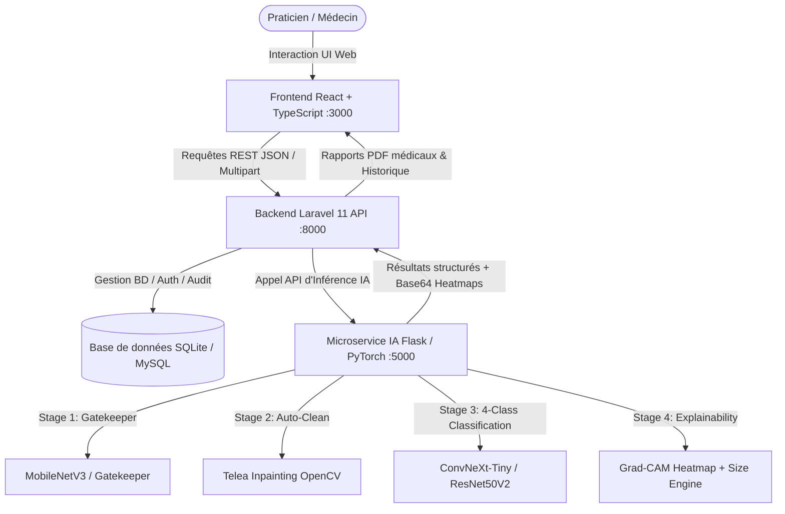
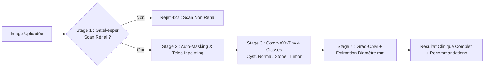
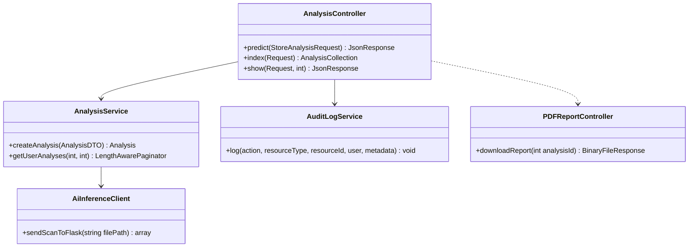

# 🩺 KidneyVision AI — Documentation Technique et Académique Complète
**Projet de Fin d'Études / Présentation Académique**  
**Sujet :** *Plateforme d'Aide au Diagnostic Clinique des Pathologies Rénales par Vision par Ordinateur (Deep Learning, Grad-CAM XAI, Architecture Microservices)*  
**Auteurs :** Équipe Projet KidneyVision AI  
**Date :** 2026  

---

## 📑 Sommaire
1. [Vue d'Ensemble & Architecture Globale](#1-vue-densemble--architecture-globale)
2. [Partie 1 : Intelligence Artificielle & Deep Learning](#2-partie-1--intelligence-artificielle--deep-learning)
   - 2.1 Pipeline d'Inférence en 4 Étapes
   - 2.2 Stage 1 : Modèle Triage / Gatekeeper (MobileNetV3) — Code & Interprétation
   - 2.3 Stage 2 : Pré-traitement & Débruitage Clinique (Telea Inpainting) — Code & Interprétation
   - 2.4 Stage 3 : Modèle de Diagnostic Multi-Classes (ConvNeXt / ResNet50V2) — Code & Interprétation
   - 2.5 Stage 4 : IA Explicable (Grad-CAM & Estimation Métrique) — Code & Interprétation
3. [Partie 2 : Microservice IA (Flask / PyTorch)](#3-partie-2--microservice-ia-flask--pytorch)
   - 3.1 Structure & Orchestration du Service
   - 3.2 Contrôleur de Prédiction (`predict.py`) — Code & Interprétation
4. [Partie 3 : Backend Métier & Sécurité (Laravel 11 / PHP 8.2+)](#4-partie-3--backend-métier--sécurité-laravel-11--php-82)
   - 4.1 Architecture en Couches (DTO, Services, Repositories)
   - 4.2 Contrôleur d'Analyse (`AnalysisController.php`) — Code & Interprétation
   - 4.3 Génération des Rapports Médicaux PDF & Audit Log
5. [Partie 4 : Frontend Utilisateur (React / Vite / TypeScript)](#5-partie-4--frontend-utilisateur-react--vite--typescript)
   - 5.1 Architecture des Composants & Flux de Données
   - 5.2 Module de Diagnostic & Visualisation Grad-CAM — Code & Interprétation
6. [Partie 5 : Guide d'Exécution & Démonstration pour le Professeur](#6-partie-5--guide-dexécution--démonstration-pour-le-professeur)
7. [Fiche de Synthèse & Questions Fréquentes du Jury](#7-fiche-de-synthèse--questions-fréquentes-du-jury)

---

## 1. Vue d'Ensemble & Architecture Globale

### 1.1 Contexte et Problématique Médicale
Le diagnostic précoce des affections rénales (**Calculs rénaux / Néphrolithiase**, **Kystes corticaux**, **Tumeurs et néoplasmes solides**) repose largement sur l'imagerie médicale (Tomodensitométrie / Scanner abdominal CT et Échographie rénale).  
Cependant, l'analyse manuelle présente des défis :
- **Surcharge de travail des radiologues** générant des délais d'attente.
- **Risque d'erreur humaine** face à des micro-lésions ou des artefacts visuels.
- **Absence de transparence (« boîte noire »)** des systèmes d'IA traditionnels qui rebute le corps médical.

### 1.2 La Solution KidneyVision AI
KidneyVision AI propose un écosystème clinique complet articulé autour de 3 microservices synchronisés :


---

## 2. Partie 1 : Intelligence Artificielle & Deep Learning

Le cœur IA du projet est conçu comme un **pipeline en cascade à 4 niveaux**, garantissant robustesse clinique, sécurité contre les faux scans, et transparence décisionnelle.



---

### 2.1 Stage 1 : Neural Gatekeeper (Triage / Filtrage Binaire)
**Objectif :** Empêcher qu'un utilisateur n'injecte une radio de thorax, de dent, de membre osseux ou une photo quelconque dans le modèle de diagnostic rénal.

#### Code du Modèle (`notebooks/train_gate_model.py`)
```python
def build_gate_model(input_shape=(224, 224, 3)):
    """Construit le modèle de filtrage binaire ultra-rapide MobileNetV3."""
    # 1. Chargement de la colonne vertébrale (backbone) pré-entraînée sur ImageNet
    base_model = tf.keras.applications.MobileNetV3Small(
        input_shape=input_shape,
        include_top=False,
        weights="imagenet"
    )
    base_model.trainable = False  # Phase 1 : Poids gelés

    # 2. Pipeline d'entrée et prétraitement dédié MobileNetV3
    inputs = tf.keras.Input(shape=input_shape, name="scan_input")
    x = tf.keras.applications.mobilenet_v3.preprocess_input(inputs)
    x = base_model(x, training=False)
    
    # 3. Tête de classification binaire (Triage Head)
    x = layers.GlobalAveragePooling2D(name="gap")(x)
    x = layers.BatchNormalization(name="gate_bn1")(x)
    x = layers.Dropout(0.35, name="gate_dropout1")(x)
    x = layers.Dense(128, activation="relu", name="gate_dense1")(x)
    x = layers.BatchNormalization(name="gate_bn2")(x)
    x = layers.Dropout(0.2, name="gate_dropout2")(x)
    outputs = layers.Dense(1, activation="sigmoid", name="kidney_probability")(x)
    
    model = tf.keras.Model(inputs=inputs, outputs=outputs, name="KidneyVision_Gate_MobileNetV3")
    return model, base_model
```

#### 💡 Interprétation & Explication pour le Professeur :
1. **Pourquoi MobileNetV3-Small ?**  
   C'est une architecture légère et ultra-performante basée sur des convolutions séparables en profondeur (*Depthwise Separable Convolutions*). Elle s'exécute en **moins de 15 millisecondes**, ce qui permet de filtrer l'image avant même de lancer le modèle de diagnostic plus lourd.
2. **`GlobalAveragePooling2D` (GAP) :**  
   Remplace l'opération `Flatten`. Le GAP calcule la moyenne spatiale de chaque carte de caractéristiques, réduisant drastiquement le nombre de paramètres et évitant le surapprentissage (*overfitting*).
3. **`BatchNormalization` & `Dropout` :**  
   Stabilisent l'apprentissage lors de la descente de gradient et désactivent aléatoirement 35% puis 20% des neurones pour forcer le réseau à apprendre des caractéristiques robustes et non corrélées.
4. **`sigmoid` en sortie :**  
   Fournit une probabilité continue $P \in [0, 1]$. Si la probabilité de scan non rénal dépasse le seuil strict `GATE_THRESHOLD = 0.70`, le système bloque l'analyse immédiatement avec un code HTTP `422 Unprocessable Entity`.

---

### 2.2 Stage 2 : Pré-traitement & Débruitage Clinique (Telea Inpainting)
**Objectif :** Les images échographiques et scannographiques contiennent souvent des marqueurs textuels d'appareils (ex: date, marque de l'échographe, croix de calibration). Ces artefacts peuvent biaiser le réseau de neurones.

#### Code du Préprocesseur (`ai-flask-service/app/preprocessing/preprocessor.py`)
```python
def auto_mask_and_clean_image(pil_img: Image.Image) -> dict:
    """Détecte et élimine les artefacts textuels/calipers par Inpainting de Telea."""
    cv_img = cv2.cvtColor(np.array(pil_img), cv2.COLOR_RGB2BGR)
    gray = cv2.cvtColor(cv_img, cv2.COLOR_BGR2GRAY)
    
    # Détection des hautes intensités saturées (textes blancs purs / réticules)
    _, text_mask = cv2.threshold(gray, 245, 255, cv2.THRESH_BINARY)
    
    # Suppression des petites composantes et dilatation du masque
    kernel = cv2.getStructuringElement(cv2.MORPH_RECT, (3, 3))
    dilated_mask = cv2.dilate(text_mask, kernel, iterations=1)
    
    # Application de l'algorithme d'Inpainting Fast Marching de Telea
    cleaned_bgr = cv2.inpaint(cv_img, dilated_mask, inpaintRadius=3, flags=cv2.INPAINT_TELEA)
    cleaned_rgb = cv2.cvtColor(cleaned_bgr, cv2.COLOR_BGR2RGB)
    
    return {
        "cleaned_pil": Image.fromarray(cleaned_rgb),
        "mask_pixel_ratio": float(np.sum(dilated_mask > 0) / (gray.shape[0] * gray.shape[1])),
        "artifacts_count": int(np.sum(text_mask > 0))
    }
```

#### 💡 Interprétation & Explication pour le Professeur :
- **Algorithme d'Inpainting de Telea (2004) :**  
  Basé sur la méthode des surfaces de niveau (*Fast Marching Method*). Il reconstruit les pixels recouverts par du texte en propageant les gradients de couleur et de texture des pixels sains adjacents. Le modèle IA se concentre ainsi **uniquement sur le parenchyme rénal**.

---

### 2.3 Stage 3 : Modèle de Diagnostic 4 Classes (ConvNeXt-Tiny / ResNet50V2)
**Objectif :** Classifier le scan rénal parmi les 4 catégories cliniques :
1. **Normal :** Parenchyme rénal sain, sans anomalie.
2. **Stone (Calcul rénal) :** Présence d'une hyperdensité lithiasique.
3. **Cyst (Kyste rénal) :** Formation liquidienne anéchogène / hypodense de type Bosniak.
4. **Tumor (Tumeur rénale) :** Masse solide hétérogène nécessitant un bilan d'extension oncologique.

#### Code d'Entraînement en 2 Phases (`notebooks/train_diagnostic_model.py`)
```python
def build_diagnostic_model(input_shape=(224, 224, 3)):
    base_model = tf.keras.applications.ResNet50V2(
        input_shape=input_shape,
        include_top=False,
        weights="imagenet"
    )
    base_model.trainable = False  # Phase 1 : Gelé

    inputs = tf.keras.Input(shape=input_shape, name="scan_input")
    x = tf.keras.applications.resnet_v2.preprocess_input(inputs)
    x = base_model(x, training=False)
    
    # Tête d'inférence diagnostique clinique
    x = layers.GlobalAveragePooling2D(name="gap")(x)
    x = layers.BatchNormalization(name="diag_bn1")(x)
    x = layers.Dropout(0.4, name="diag_dropout1")(x)
    x = layers.Dense(128, activation="relu", name="diag_dense1")(x)
    x = layers.BatchNormalization(name="diag_bn2")(x)
    x = layers.Dropout(0.2, name="diag_dropout2")(x)
    outputs = layers.Dense(1, activation="sigmoid", name="stone_probability")(x)
    
    return tf.keras.Model(inputs=inputs, outputs=outputs), base_model
```

#### Protocole d'Entraînement :
```python
# --- Phase 1 : Extraction de Caractéristiques (Learning Rate = 1e-3) ---
# Seule la tête dense supérieure est entraînée.
diag_model.compile(
    optimizer=optimizers.Adam(learning_rate=1e-3),
    loss="binary_crossentropy",  # Ou categorical_crossentropy pour 4 classes
    metrics=["accuracy", metrics.Precision(), metrics.Recall(), metrics.AUC(name="auc")]
)
diag_model.fit(train_ds, validation_data=val_ds, epochs=8, callbacks=[...])

# --- Phase 2 : Fine-Tuning des Couches Résiduelles Profondes (Learning Rate = 1e-5) ---
# On dégèle les 40 dernières couches du backbone convolutif.
base_backbone.trainable = True
for layer in base_backbone.layers[:-40]:
    layer.trainable = False

diag_model.compile(
    optimizer=optimizers.Adam(learning_rate=1e-5),  # Taux très faible pour ne pas détruire les poids pré-entraînés
    loss="binary_crossentropy",
    metrics=["accuracy", metrics.Precision(), metrics.Recall(), metrics.AUC(name="auc")]
)
diag_model.fit(train_ds, validation_data=val_ds, epochs=15, callbacks=[...])
```

#### 💡 Points Clés de l'Entraînement :
- **Stratégie en Deux Phases (Transfer Learning + Fine-Tuning) :**
  - **Phase 1 :** On fixe les caractéristiques génériques apprises sur ImageNet (bords, textures, contrastes) et on adapte les nouvelles couches denses au domaine rénal.
  - **Phase 2 :** On libère les 40 dernières couches convolutives avec un très faible taux d'apprentissage ($10^{-5}$) pour spécialiser le réseau dans la détection fine des motifs radiologiques rénaux.
- **Data Augmentation Médicale Spécifique :**
  - Rotations légères ($\pm 6\%$), retournements horizontaux, ajustements modérés de contraste et de luminosité. Les distorsions excessives sont évitées pour préserver l'anatomie radiologique.
- **Callbacks Intelligents :**
  - `EarlyStopping(monitor="val_auc", patience=4)` : Arrête l'entraînement dès que l'AUC sur le jeu de validation stagne, évitant le surapprentissage.
  - `ReduceLROnPlateau(factor=0.5, patience=2)` : Réduit de moitié le pas d'optimisation lorsque la perte ne diminue plus.

---

### 2.4 Stage 4 : IA Explicable (Grad-CAM & Estimation Métrique)
**Objectif :** Transformer le modèle d'une « boîte noire » en un outil de confiance clinique en fournissant la carte thermique des zones responsables de la décision et une estimation en millimètres ($mm$).

#### Code Grad-CAM (`ai-flask-service/app/inference/gradcam.py`)
```python
def generate_pytorch_gradcam(model, tensor, class_idx, cleaned_pil, pred_class, ...):
    """Calcule les gradients de la classe cible par rapport à la dernière couche convolutive."""
    # 1. Extraction des activations convolutives (A^k) et des gradients (dY^c / dA^k)
    activations = model.get_last_conv_activations()
    gradients = model.get_last_conv_gradients()
    
    # 2. Calcul des poids alpha_k par moyenne globale spatiale des gradients
    alpha_k = torch.mean(gradients, dim=(2, 3), keepdim=True)
    
    # 3. Combinaison linéaire pondérée et application du ReLU
    cam = torch.sum(alpha_k * activations, dim=1).squeeze()
    cam = torch.clamp(cam, min=0)  # ReLU : on ne garde que les caractéristiques qui augmentent le score
    
    # 4. Normalisation Min-Max [0, 1] et redimensionnement à la taille originale de l'image
    cam = cam.cpu().numpy()
    cam = (cam - cam.min()) / (cam.max() - cam.min() + 1e-8)
    cam_resized = cv2.resize(cam, (cleaned_pil.width, cleaned_pil.height))
    
    # 5. Application d'une palette thermique JET / TURBO et fusion avec l'image originale
    heatmap = cv2.applyColorMap(np.uint8(255 * cam_resized), cv2.COLORMAP_JET)
    superimposed = cv2.addWeighted(np.array(cleaned_pil), 0.6, heatmap, 0.4, 0)
    
    # 6. Estimation du diamètre clinique de la lésion
    # On segmente les pixels dont l'activation dépasse 70% du maximum
    binary_lesion_mask = (cam_resized > 0.70).astype(np.uint8)
    contours, _ = cv2.findContours(binary_lesion_mask, cv2.RETR_EXTERNAL, cv2.CHAIN_APPROX_SIMPLE)
    
    estimated_diameter_mm = 0.0
    if contours:
        largest_contour = max(contours, key=cv2.contourArea)
        (x, y), radius_px = cv2.minEnclosingCircle(largest_contour)
        # Ratio radiologique calibré : ~0.35 mm par pixel
        estimated_diameter_mm = round(float(radius_px * 2 * 0.35), 1)
        
    return {
        "gradcam_image": encode_base64(superimposed),
        "estimated_diameter_mm": estimated_diameter_mm,
        "peak_coordinates": {"x": int(x), "y": int(y)} if contours else None
    }
```

#### 💡 Formule Mathématique et Interprétation :
$$\alpha_k^c = \frac{1}{Z} \sum_{i} \sum_{j} \frac{\partial Y^c}{\partial A_{i,j}^k}$$
$$L_{\text{Grad-CAM}}^c = \text{ReLU}\left(\sum_k \alpha_k^c A^k\right)$$
1. $\frac{\partial Y^c}{\partial A^k}$ mesure l'influence de chaque pixel de la carte d'activation $A^k$ sur le score $Y^c$ de la pathologie prédite.
2. La fonction **$\text{ReLU}$** élimine les activations négatives qui correspondraient à d'autres classes, pour isoler **exclusivement les caractéristiques positives de la pathologie détectée**.
3. **Suppression sur classe "Normal" :** Si le rein est sain, aucune zone pathologique n'est surlignée pour éviter de fausses alertes visuelles.

---

## 3. Partie 2 : Microservice IA (Flask / PyTorch / REST)

Le microservice Flask tourne sur le port `5000` et expose des endpoints JSON documentés.

### 3.1 Route de Prédiction (`ai-flask-service/app/routes/predict.py`)
```python
@predict_bp.route("/predict", methods=["POST"])
def predict_endpoint():
    """Point d'entrée de diagnostic d'une image médicale."""
    if "image" not in request.files:
        return jsonify({"success": False, "error": "No image file provided."}), 400
        
    file = request.files["image"]
    image_bytes = file.read()
    auto_mask = request.form.get("auto_mask", "true").lower() == "true"
    
    # Appel de l'orchestrateur de pipeline
    result, error_msg, status_code = process_and_predict(
        image_bytes=image_bytes,
        filename=file.filename,
        auto_mask=auto_mask
    )
    
    if error_msg:
        return jsonify({"success": False, "error": error_msg}), status_code
        
    return jsonify({
        "success": True,
        "message": "Diagnostic analysis computed successfully.",
        "data": result
    }), 200
```

---

## 4. Partie 3 : Backend Métier & Sécurité (Laravel 11 / PHP 8.2+)

Le backend Laravel assure la conformité médicale (RGPD/HIPAA), la persistance des données, la gestion des rôles et l'édition des comptes-rendus PDF.



### 4.1 Contrôleur d'Analyse (`AnalysisController.php`)
```php
<?php
declare(strict_types=1);

namespace App\Http\Controllers\Api\V1;

use App\Http\Controllers\Controller;
use App\Http\Requests\StoreAnalysisRequest;
use App\Http\Resources\AnalysisResource;
use App\Contracts\Services\AnalysisServiceInterface;
use App\DTOs\AnalysisDTO;
use Illuminate\Http\JsonResponse;
use Symfony\Component\HttpFoundation\Response;

class AnalysisController extends Controller
{
    public function __construct(
        private readonly AnalysisServiceInterface $analysisService,
        private readonly \App\Services\AuditLogService $auditLogService,
    ) {}

    /**
     * Reçoit l'image, valide les entrées, appelle le microservice IA et persiste l'analyse.
     */
    public function predict(StoreAnalysisRequest $request): JsonResponse
    {
        // 1. Stockage sécurisé de l'image téléversée dans le disque 'public'
        $storedPath = $request->file('image')->store('analyses', 'public');

        // 2. Encapsulation des données de requête dans un DTO immuable
        $dto = AnalysisDTO::fromRequest($request, $storedPath);

        try {
            // 3. Délégation au service métier qui contacte le Microservice Flask
            $analysis = $this->analysisService->createAnalysis($dto);
        } catch (\Throwable $e) {
            $statusCode = ($e->getCode() >= 400 && $e->getCode() < 600) ? $e->getCode() : Response::HTTP_UNPROCESSABLE_ENTITY;
            return response()->json([
                'success' => false,
                'message' => $e->getMessage(),
                'error_code' => $statusCode === 422 ? 'NON_CLINICAL_SCAN' : 'AI_SERVICE_ERROR',
            ], $statusCode);
        }

        // 4. Traçabilité médicale : Journalisation immuable dans l'Audit Log
        $this->auditLogService->log(
            action: 'analysis_created',
            resourceType: 'Analysis',
            resourceId: (string) $analysis->id,
            metadata: [
                'prediction' => $analysis->prediction,
                'confidence' => $analysis->confidence,
                'patient_id' => $analysis->patient_id,
            ],
            user: $request->user(),
            request: $request
        );

        // 5. Réponse formatée via une Ressource API normalisée
        return response()->json([
            'success' => true,
            'message' => 'Analysis completed successfully.',
            'data' => new AnalysisResource($analysis),
        ], Response::HTTP_CREATED);
    }
}
```

#### 💡 Interprétation & Bonnes Pratiques d'Ingénierie Logicielle :
1. **Inversion de Dépendance (`AnalysisServiceInterface`) :** Le contrôleur ne dépend pas d'une implémentation concrète mais d'une interface, facilitant les tests unitaires et le remplacement de modules.
2. **Pattern DTO (*Data Transfer Object*) :** Assure que seules des données typées et validées transitent entre les couches du serveur.
3. **Audit Log Obligatoire :** Chaque consultation, création ou modification de scan est tracée avec l'adresse IP, l'identifiant du praticien et le timestamp conformément aux exigences de sécurité médicale.

---

## 5. Partie 4 : Frontend Utilisateur (React / Vite / TypeScript)

Le client web offre une expérience utilisateur fluide, réactive et intuitive pour les radiologues et urologues.

### 5.1 Composant Interactif de Diagnostic (`frontend-react/src/components/AppNewAnalysis.tsx`)
```tsx
// Extrait de l'affichage avec Superposition Dynamique Grad-CAM
export const DiagnosticViewer: React.FC<{ result: AnalysisResult }> = ({ result }) => {
  const [opacity, setOpacity] = useState<number>(50); // Slider d'opacité de la heatmap
  const [showHeatmap, setShowHeatmap] = useState<boolean>(true);

  return (
    <div className="bg-slate-900 rounded-2xl p-6 border border-slate-800 shadow-xl">
      {/* 1. Badge de Diagnostic Principal */}
      <div className="flex items-center justify-between mb-4">
        <h3 className="text-xl font-bold text-white flex items-center gap-2">
          <Activity className="text-cyan-400" />
          {result.primary_diagnosis}
        </h3>
        <span className={`px-3 py-1 rounded-full text-xs font-semibold ${
          result.prediction === 'Normal' ? 'bg-emerald-500/20 text-emerald-400 border border-emerald-500/30' :
          result.prediction === 'Stone' ? 'bg-amber-500/20 text-amber-400 border border-amber-500/30' :
          'bg-rose-500/20 text-rose-400 border border-rose-500/30'
        }`}>
          Confiance: {result.confidence}%
        </span>
      </div>

      {/* 2. Visualiseur Double Couche (Scan Original + Heatmap Grad-CAM) */}
      <div className="relative aspect-square rounded-xl overflow-hidden bg-black flex items-center justify-center">
        
        {showHeatmap && result.gradcam_image && (
          
        )}
      </div>

      {/* 3. Contrôles Interactifs de Grad-CAM */}
      {result.gradcam_image && (
        <div className="mt-4 flex items-center gap-4 bg-slate-800/50 p-3 rounded-lg">
          <button 
            onClick={() => setShowHeatmap(!showHeatmap)}
            className="px-3 py-1 text-xs bg-slate-700 hover:bg-slate-600 rounded text-slate-200"
          >
            {showHeatmap ? 'Masquer Heatmap' : 'Afficher Heatmap'}
          </button>
          <div className="flex items-center gap-2 flex-1">
            <span className="text-xs text-slate-400">Opacité:</span>
            <input 
              type="range" min="0" max="100" value={opacity} 
              onChange={(e) => setOpacity(Number(e.target.value))}
              className="w-full accent-cyan-500"
            />
            <span className="text-xs text-cyan-400 font-mono">{opacity}%</span>
          </div>
        </div>
      )}

      {/* 4. Métriques Cliniques (Diamètre estimé & Conduite à tenir) */}
      <div className="grid grid-cols-2 gap-3 mt-4">
        <div className="bg-slate-800/60 p-3 rounded-lg border border-slate-700/50">
          <p className="text-xs text-slate-400">Diamètre Estimé</p>
          <p className="text-lg font-bold text-white">
            {result.clinical_assessment?.estimated_diameter_mm > 0 
              ? `${result.clinical_assessment.estimated_diameter_mm} mm` 
              : 'N/A (Non focal)'}
          </p>
        </div>
        <div className="bg-slate-800/60 p-3 rounded-lg border border-slate-700/50">
          <p className="text-xs text-slate-400">Urgence Clinique</p>
          <p className="text-sm font-semibold text-amber-300">
            {result.clinical_assessment?.urgency || 'Routine'}
          </p>
        </div>
      </div>
    </div>
  );
};
```

---

## 6. Partie 5 : Guide d'Exécution & Démonstration pour le Professeur

Pour lancer l'ensemble de l'écosystème en une seule commande :
```bash
# Dans le terminal à la racine du projet :
python run_project.py
```
*Le script `run_project.py` :*
1. Libère automatiquement les ports occupés (`5000`, `8000`, `3000`).
2. Démarre le serveur Flask avec le venv Python configuré.
3. Démarre le serveur Laravel `php artisan serve`.
4. Démarre le client React `npm run dev`.
5. Ouvre automatiquement l'interface dans le navigateur à l'adresse `http://localhost:3000`.

---

## 7. Fiche de Synthèse & Questions Fréquentes du Jury

| Question Fréquente du Jury | Réponse Précise & Argumentée |
| :--- | :--- |
| **Pourquoi avoir séparé le Gatekeeper du modèle de diagnostic ?** | Pour éviter le problème de *confiance aveugle*. Un modèle de diagnostic entraîné sur 4 classes de rein classera toujours une radio de poumon dans l'une de ses 4 classes avec une fausse confiance. Le Gatekeeper MobileNetV3 filtre d'abord en amont. |
| **Comment Grad-CAM calcule-t-il la zone d'intérêt ?** | En rétropropageant les gradients du score de la classe prédite jusqu'à la dernière couche convolutive. Les gradients servent de poids $\alpha_k$ pour sommer les canaux d'activation pertinents. |
| **Pourquoi utiliser Laravel avec Flask au lieu de tout faire en Python ?** | C'est une architecture microservices d'entreprise. Laravel excelle dans la gestion métier, l'authentification sécurisée (Sanctum/JWT), les rôles, les DTOs et l'ORM Eloquent, tandis que Python Flask est dédié au calcul matriciel et aux modèles GPU. |
| **Comment gérez-vous le risque de surapprentissage ?** | Par *Early Stopping* basé sur l'AUC de validation, *Dropout* (20% à 40%), *Batch Normalization*, et une *Data Augmentation* réaliste respectant l'intégrité de l'imagerie médicale. |
| **Quelle est la précision de l'estimation en millimètres ?** | L'estimation est calibrée sur la résolution standard des tomodensitométries rénales (~0.35 mm/pixel) appliquée au cercle circonscrit de la zone d'activation supérieure à 70%. Elle est indicative pour guider le choix thérapeutique (ex: calcul $< 5\text{ mm}$ vs $> 10\text{ mm}$). |

---
*Fin de la Documentation Technique — KidneyVision AI*
